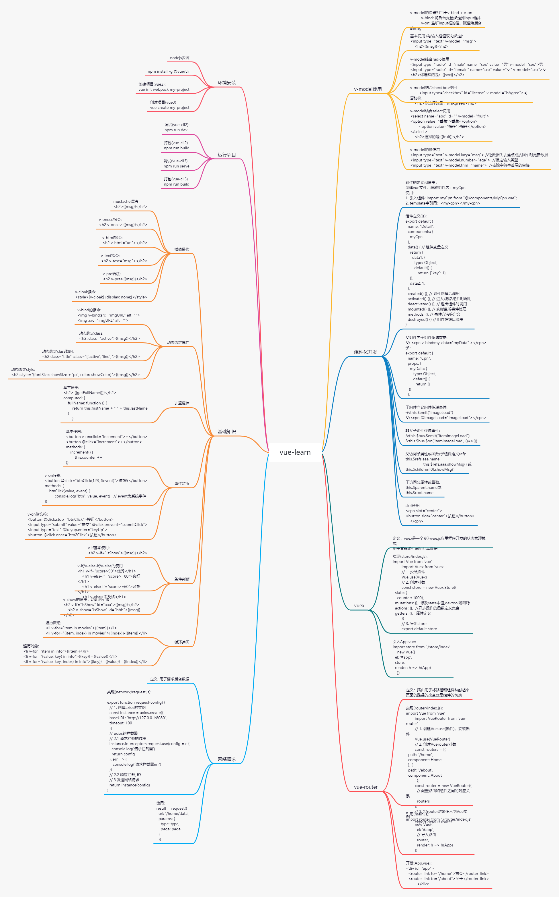

# vuejs的学习笔记

## 运行项目

#### node安装
`下载nodes，并安装`

#### 安装依赖

`cd 项目实践/supermall的实践/supermall`

`npm install |vue, axios, better-scroll", vue-load, vue-router, vuex]`

#### 开发环境运行
`npm run serve`

#### 生产环境编译
`npm run build`

## vue知识梳理
&nbsp;&nbsp;&nbsp;&nbsp; 此文主要针对vue的知识进行梳理，包括环境安装、运行项目、基础知识及一些较为高阶的技术，比如：v-model的使用、 组件化开发、vuex、vue-router和网络请求的封装。

### vue知识框架


### 环境安装
`1. 下载nodejs安装`

`2. npm install -g @vue/cli  # -g 表示全局安装`

`3. vue-cli2初始化项目: vue init webpack [my-project]`

`4. vue-cli3初始化项目: vue create [my-project]`

### 运行项目
`1. vue-cli2开发环境运行: npm run dev`

`2. vue-cli2生产环境打包：npm run build`

`3. vue-cli3开发环境运行: npm run serve`

`4. vue-cli3生产环境打包: npm run build`

### 基础知识
#### 插值操作

1. mustache语法
```html
<!-- 1. mustache语法 -->
<h2>{{msg}}</h2>
```

2. v-onece指令
```html
<!-- 2. v-onece指令 -->
<h2 v-once> {{msg}}</h2>
```

3. v-html指令
```html
<!-- 3. v-html指令 -->
<h2 v-html="url"> </h2>
```

4. v-text指令
```html
<!-- 4. v-text指令 -->
<h2 v-text="msg"></h2>
```

5. v-pre语法
```html
<!-- 5. v-pre语法 -->
<h2 v-pre>{{msg}}</h2>
```

6. v-cloak指令
```html
<!-- 6. v-cloak指令 -->
<style>[v-cloak] {display: none;}</style>
```

#### 动态绑定属性

1. v-bind的指令
```html
<!-- v-bind的指令: -->


```

2. 动态绑定class
```html
<!-- 动态绑定class: -->
<h2 :class="active">{{msg}}</h2>
```

3. 动态绑定class数组
```html
<!-- 动态绑定class数组: -->
<h2 class="title" :class="['active', 'line']">{{msg}}</h2>
```

4. 动态绑定style
```html
<!-- 动态绑定style: -->
<h2 :style="{fontSize: showSize + 'px', color: showColor}">{{msg}}</h2>
```

#### 计算属性
1. 基本使用
```html
<!-- 基本使用 -->
<h2> {{getFullName()}}</h2>
```
```js
const app = new Vue({
    el: "#app",
    data: {
        firstName: "a",
        lastName: "cedar"
    },
    computed: {
        fullName: function () {
            return this.firstName + " " + this.lastName
        }
    }
})
```

#### 事件监听
1. 基本使用
```html
<!--基本使用 -->
<div>
    <button v-on:click="increment">+</button>
    <button @click="increment">+</button>
</div>
```
```js
const app = new Vue({
    el: "#app",
    data: {
        counter: 0,
    },
    methods: {
        increment() {
            this.counter++
        }
    }
})
```

2. v-on传参
```html
<!-- v-on传参 -->
<div>
    <button @click="btnClick(123, $event)">按钮</button>
</div>
```
```js
const app = new Vue({
    el: "#app",
    data: {
        counter: 0,
    },
    methods: {
        btnClick(value, event) {
            console.log("btn", value, event)   // event为系统事件
        }
    }
})
```

3. v-on修饰符
```html
<!-- v-on修饰符 -->
v-on修饰符:
<button @click.stop="btnClick">按钮</button>
<input type="submit" value="提交" @click.prevent="submitClick">
<input type="text" @keyup.enter="keyUp">
<button @click.once="btn2Click">按钮</button>
```

#### 条件判断
1. v-if基本使用
```html
<!-- v-if基本使用:-->
<h2 v-if="isShow">{{msg}}</h2>
```

2. v-if/v-else-if/v-else的使用
```html
<!--v-if/v-else-if/v-else的使用-->
<h1 v-if="score>90">优秀</h1>
<h1 v-else-if="score>=80">良好</h1>
<h1 v-else-if="score>=60">及格</h1>
<h1 v-else>不及格</h1>
```

3. v-show的使用
```html
<!--v-show的使用，功能同v-if:-->
<h2 v-if="isShow" id="aaa">{{msg}}</h2>
<h2 v-show="isShow" id="bbb">{{msg}}</h2>
```

#### 循环遍历
1. 遍历数组
```html
<!--遍历数组:-->
<li v-for="item in movies">{{item}}</li>
<li v-for="(item, index) in movies">{{index}}-{{item}}</li>
```

2. 遍历对象
```html
<!--遍历对象:-->
<li v-for="item in info">{{item}}</li>
<li v-for="(value, key) in info">{{key}} - {{value}}</li>
<li v-for="(value, key, index) in info">{{key}} - {{value}} - {{index}}</li>
```

### v-model的使用
1. 定义
```
v-model说明：
v-model的原理相当于v-bind + v-on
v-bind: 将后台变量绑定到input框中
v-on: 监听input框的值，赋值给后台的msg
```

2. 基本使用
```html
<!--基本使用 (与输入框值双向绑定):-->
<input type="text" v-model="msg">
<h2>{{msg}}</h2>
```

3. v-model结合radio使用
```html
<!--v-model结合radio使用-->
<input type="radio" id="male" name="sex" value="男" v-model="sex">男
<input type="radio" id="female" name="sex" value="女" v-model="sex">女
<h2>你选择的是：{{sex}}</h2>
```

4. v-model结合checkbox使用
```html
<!--v-model结合checkbox使用-->
<input type="checkbox" id="license" v-model="isAgree">同意协议
<h2>你选择的是：{{isAgree}}</h2>
```

5. v-model结合select使用
```html
<!--v-model结合select使用-->
<select name="abc" id="" v-model="fruit">
    <option value="香蕉">香蕉</option>
    <option value="榴莲">榴莲</option>
</select>
<h2>选择的是:{{fruit}}</h2>
```

5. v-model的修饰符
```html
<!--v-model的修饰符-->
<input type="text" v-model.lazy="msg"> //让数据失去焦点或按回车时更新数据
<input type="text" v-model.number="age">  //指定输入类型
<input type="text" v-model.trim="name">  //去除字符串首尾的空格
```

### 组件化开发
```
组件的定义和使用：
创建vue文件，获取组件名：myCpn
使用：
1. 引入组件: import myCpn from "@/components/MyCpn.vue";
2. template中引用：<my-cpn></my-cpn>
```
```待补充组件内部执行流程图```

1. 组件定义(js)
```js
// 组件定义(js):
export default {
  name: "Detail",
  components: {
    myCpn
  },
  data() { // 组件变量定义
    return {
      data1: {
        type: Object,
        default() {
           return {"key": 1}
        }
      },
    data2: 1,
    }
  },
  created() {}, // 组件创建后调用
  activated() {}, // 进入/激活组件时调用
  deactivated() {}, // 退出组件时调用
  mounted() {}, // 实时监听事件处理
  methods: {}, // 事件方法等定义
  destroyed() {} // 组件销毁后调用
}
```

2. 父组件向子组件传递数据
```js
// 父: 
    <cpn v-bind:my-data="myData" ></cpn>
// 子：
export default {
    name: "Cpn",
    props: {
        myData: {
            type: Object,
            defaut() {
                return {}
            }
        }
    }
}
```

3. 子组件向父组件传递事件
```js
// 子:
    this.$emit("imageLoad")
// 父:
    <cpn @imageLoad="imageLoad"></cpn>
```

4. 非父子组件传递事件
```js
// 通过事件总线传递
// 组件A，发送事件:
    this.$bus.$emit("itemImageLoad")
// 组件B，处理事件:
    this.$bus.$on('itemImageLoad', ()=>{})
```

5. 父访问子属性或函数(子组件定义ref):
```js
this.$refs.aaa.name
this.$refs.aaa.showMsg()
// 或
this.$children[0].showMsg()
```

6. 子访问父属性或函数:
```js
this.$parent.name
// 或
this.$root.name
```

7. slot使用:
```js
<cpn slot="center">
<button slot="center">按钮</button>
</cpn>
```

### vuex
1. vuex定义
```
vuex是一个专为vue.js应用程序开发的状态管理模式,
用于管理组件间的共享数据
```

2. 实现(store/index.js):
```js
import Vue from 'vue'
import Vuex from 'vuex'
// 1. 安装插件
Vue.use(Vuex)
// 2. 创建对象
const store = new Vuex.Store({
  state: {
    counter: 1000}, 
  mutations: {},  修改state中值,devtool可跟踪
  actions: {},  //异步操作的函数定义集合
  getters: {},   属性定义
})
// 3. 导出store
export default store
```

3. 引入(App.vue):
```js
import store from './store/index'
new Vue({
  el: '#app',
  store,
  render: h => h(App)
})
```

### vue-router
1. 定义
```
路由用于将路径和组件映射起来,页面的路径的改变就是组件的切换
```

2. 实现(router/index.js)
```js

import Vue from 'vue'
import VueRouter from 'vue-router'
// 1. 创建Vue.use(插件)，安装插件
Vue.use(VueRouter)
// 2. 创建Vuerouter对象
const routers = [{
  path: '/home',
  component: Home
  }, {
  path: '/about',
  component: About
}]
const router = new VueRouter({
// 配置路由和组件之间的对应关系
routers
})
// 3. 将router对象传入到Vue实例
export default router
```

3. 引用(main.js) 
```js
import router from './router/index.js'
new Vue({
el: '#app',
// 导入路由
router,
render: h => h(App)
})
```

4. 开发(App.vue)
```js
<div id="app">
  <router-link to="/home">首页</router-link>
  <router-link to="/about">关于</router-link>
</div>
```

### 网络请求

1. 定义
```
用于统一请求后台数据
```

2. 实现(network/request.js)
```js
export function request(config) {
  // 1. 创建axios的实例
  const instance = axios.create({
  baseURL: 'http://127.0.0.1:8080',
  timeout: 100
})
  // axios的拦截器
  // 2.1 请求拦截的作用
  instance.interceptors.request.use(config => {
    console.log('请求拦截器')
    return config
  }, err => {
     console.log('请求拦截器err')
  })
  // 2.2 响应拦截, 略
  // 3.发送网络请求
  return instance(config)
}
```

3. 使用
```js
result = request({
  url: '/home/data',
  params: {
    type: type,
    page: page
  }
})
```

## 我的自述
```
本项目是vuejs的学习笔记，预计项目的作用包括两个：
    1.入门
    2. 开发查找字典

本项目首先对vue的一些基础语法，对应每一个功能点，都有一个或多个html对应，用户可以直接运行html文件，验证所学功能点。
另外，本项目也包含两个实战项目（见'项目实战'目录），'tabbar实战'是一个基础知识的实战项目。'supermall的实践'是一个模拟电商的实践项目，几乎涵盖了vue的所有知识点。

其中有不正确的地方，欢迎大家批评指正。
欢迎大家一起完善、共建。
```
## 声明
该项目是基于coderwhy的vuejs[教学视频](https://www.bilibili.com/video/BV15741177Eh) 的学习笔记，其中有小部分组件使用了coderwhy提供的完整版，比如swiper组件，scroll组件等。
感谢coderwhy的分享
项目中使用部分图片是coderwhy中的图片，其他多数图片都是从[网站](https://pixabay.com)获取
使用本项目的代码或图片资源，请声明来源，禁止用于任何商业行为
